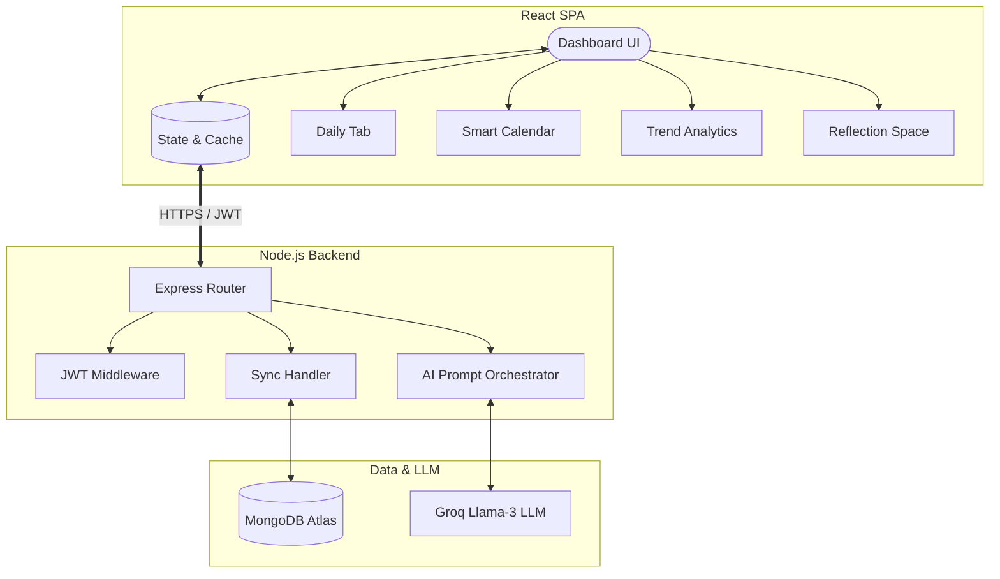

# ⚡ GoalGrid (Productive)

GoalGrid is a high-performance, AI-augmented human optimization workspace built on the MERN stack. It unifies goal roadmapping, context-aware calendar scheduling, cognitive journaling, and wellness analytics into a single cohesive dashboard.

---

## 🚀 Key Features

* **🤖 AI-Driven Roadmap Engine**: Feed in abstract, long-term goals and receive step-by-step, milestone-based weekly execution plans built via the Llama-3-70b model.
* **📅 Context-Aware Scheduler**: Define your fixed daily routine (sleep, workouts, meals), and the AI scheduler dynamically schedules tasks around your busy blocks.
* **🧠 Cognitive Reflection Space**: Evening journal assistant featuring EQ, Stoic, and ROSE coaching lenses. It analyzes entries to generate mental clarity insights.
* **📊 Well-Being Analytics**: Automated metrics dashboard mapping energy levels, common blocker correlations, and productivity trends over rolling 7-day windows.
* **🔒 Seamless Sync & Auth**: State persistence utilizing JWT-based auth and debounced autosaving to database clusters.

---

## 🛠️ Tech Stack & Architecture

GoalGrid is built as a decoupled Client-Server architecture utilizing:

* **Frontend**: React (v18), Lucide Icons, Vanilla CSS (Glassmorphism design system)
* **Backend**: Node.js, Express, REST APIs
* **Database**: MongoDB (Mongoose schemas)
* **AI Agent**: Groq Llama-3 API

### System Architecture



---

## ⚙️ Quick Start

### 1. Prerequisites
Ensure you have [Node.js](https://nodejs.org/) and [MongoDB](https://www.mongodb.com/) installed.

### 2. Backend Setup
1. Navigate to the `backend/` directory:
   ```bash
   cd backend
   ```
2. Install dependencies:
   ```bash
   npm install
   ```
3. Create a `.env` file in the `backend/` directory:
   ```env
   PORT=5000
   MONGO_URI=your_mongodb_connection_uri
   JWT_SECRET=your_jwt_secret
   GROQ_API_KEY=your_groq_api_key
   GROQ_MODEL=llama-3.3-70b-versatile
   FRONTEND_URL=http://localhost:3000
   ```
4. Start the server:
   ```bash
   npm start
   ```

### 3. Frontend Setup
1. Navigate to the root directory in a new terminal:
   ```bash
   npm install
   ```
2. Start the React app:
   ```bash
   npm start
   ```

---

## 🌐 Deployment

For step-by-step guides on deploying the React frontend on **Vercel** and the backend on **Render**, refer to the [Deployment Guide (DEPLOY.md)](file:///c:/Users/jayas/Desktop/Projects/productive/DEPLOY.md).
